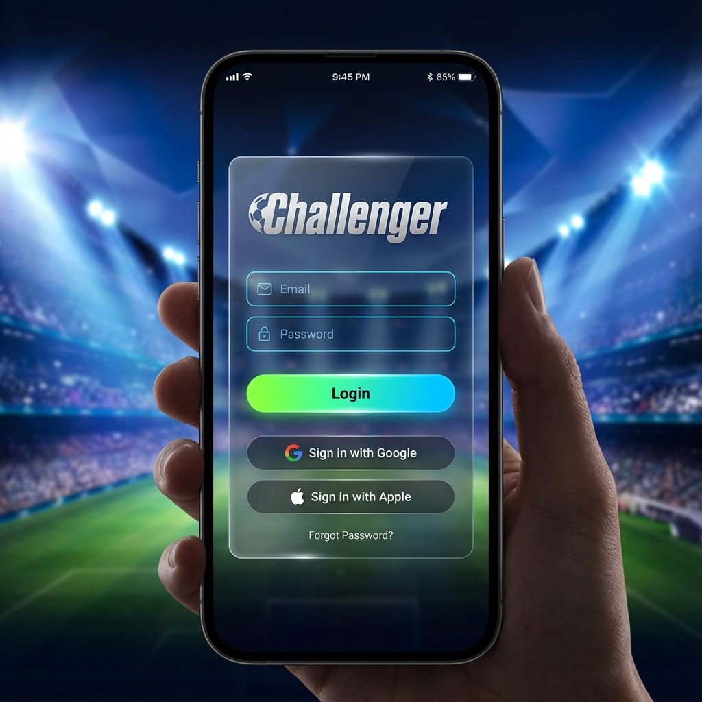
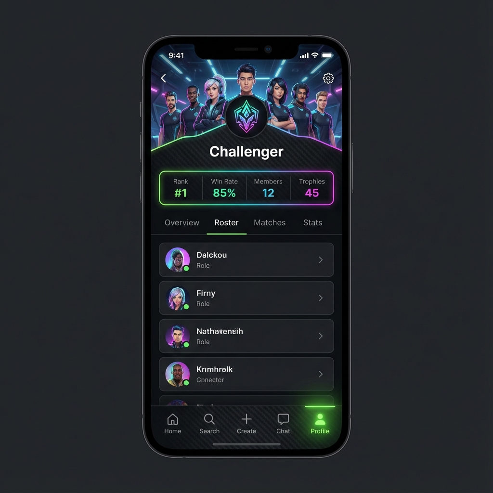
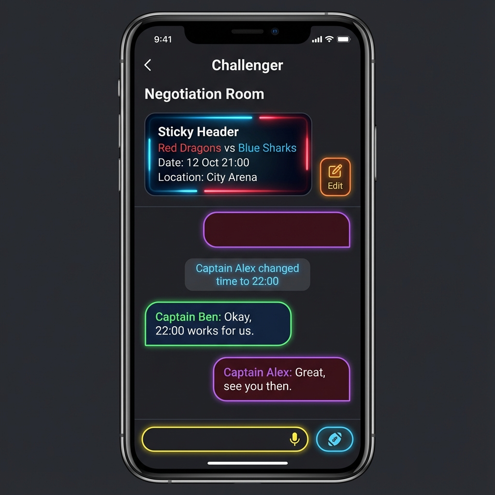

# Challenger UI Sunumu

Projenin temel ekranları için hazırlanan yüksek kaliteli arayüz tasarımları aşağıdadır. Bu görselleri sunumunuzda kullanabilirsiniz.

````carousel

**Giriş Ekranı:** Modern, karanlık tema ve stadyum atmosferi.
<!-- slide -->

**Ana Sayfa (Feed):** Sosyal etkileşim ve meydan okuma butonu. (Aktif: Home)
<!-- slide -->

**Takım Profili:** Takım istatistikleri ve oyuncu kadrosu. (Aktif: Profile)
<!-- slide -->

**Müzakere Odası:** Maç detaylarını netleştirmek için özel sohbet alanı.
<!-- slide -->

**Liderlik Tablosu:** Rekabetçi sıralama ekranı. (Aktif: Search/Trophy)
````

## Tasarım Notları
- **Tema:** Koyu Mod (Dark Mode) + Neon Yeşil/Mavi vurgular.
- **Font:** Modern Sans-Serif (Okunabilirlik ve sportiflik odaklı).
- **Efektler:** Glassmorphism (Buzlu cam) paneller ve parlak butonlar.
